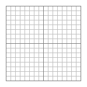
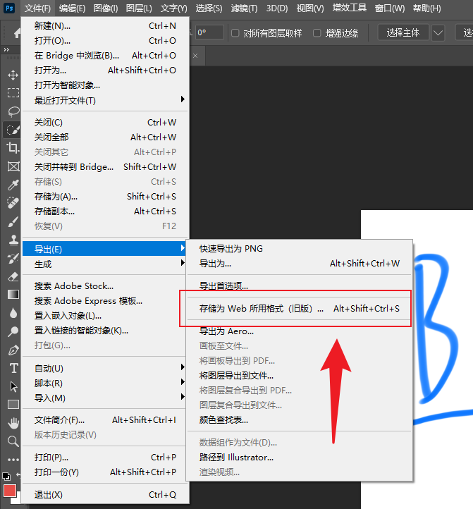
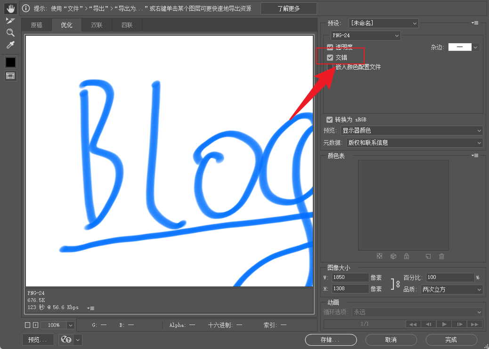

## 背景

很多人有写博客的习惯，会使用很多图片来进行表达，优化读者体验。但在网速慢的情况下，一张大图从上到下慢慢加载出来，难免会使用户焦虑。这里提出针对 jpg、png 等博客常见的图片进行交错（interlace）优化，以牺牲图片体积为前提，让用户尽快看到图片。

## 问题分析

针对图片加载慢，加载闪动，其实可以分类为两个问题。

- 图片无占位，加载闪动
    - 以博客图片举例（rspress、hexo 等），可以编写插件，在打包时获取图片宽高，进行宽高上的占位。
    - 二是打包时，可以借助一些工具，生成图片的 base64 缩略图，内联在 html 模板中，在加载后进行替换。
- 图片从上到下加载慢，闪动 + 等待时间长
    - 图片从上到下、从左向右加载，可以借助图片交错编码解决。

## 问题解决

### 图片闪动未占位

#### TODO待补充

### 图片从上到下加载慢

> 交错【interlace】

针对图片从上到下加载慢，已经有一个很好的解决方案了，那就是将图片交错编码。jpg 和 png 都很好的支持了交错编码。

#### 什么是交错

未交错图片编码顺序就是从上到下，因此网络获取的顺序也是从上到下的。用户体感上就是图片从上到下加载了。

而交错则是将图片分为若干个区，然后网络获取时会在每个区都获取一部分图片。用户体感上就是图片很快加载好，并一开始是模糊/像素的，后面逐渐清晰。

- 交错优点

    - 加载快，用户体验好

- 交错缺点
    - 图片体积变大
    - 交错处理麻烦

我以两张 gif 动图解释什么是交错。




针对图片处理，优化为交错有哪些方法呢？我归为两类：

- 通过photoshop处理图片
- 通过imagemagick处理图片

#### 方案 1 人工 photoshop 生成

如果是 UI 出图，用 photoshop 没有什么不方便的。但以我自己写博客为例，多是画一张图，或截一张图，这个时候如果都用 photoshop 手动处理就怪麻烦了~





#### 方案 2 借助 imagemagick 生成


imagemagick 是一个很牛的图片处理程序，可在 windows、macos、linux 上安装使用。很多图片处理软件也使用了它。可以说他在图片处理的地位和 ffmpeg（一个视频处理软件）相当。

它作为图片处理的瑞士军刀，提供了大量有用的命令行工具。例如 convert（图片转换工具）、identify（图片信息获取工具）等，下面我们会使用这 identify 来识别图像是否是交错的，并使用 convert 来将没有交错的图片交错。

下面我们使用一个 shell script 对一个目录下的图片进行处理，若未交错，则改为交错；若已经为交错，则不处理。

- 使用`convert -interlace plane -quality 80 $filename $newfilename`来将图片优化为交错的图片。

    - 其中这条命令还将图片的质量设置为 80，以避免交错后体积会大量增长（没错体积会增长，但加载顺序由精致的局部变成了粗略的全局）。

- 使用`identify -quiet -format "%[interlace]" $filename`来获取图片是否为交错的。

- 使用`find ../docs/public/ -iname "*.png" -o -iname "*.jpg" -o -iname "*.jpeg"`来查找指定目录下，以 png、jpe?g 结尾的图片。

话不多说，上链接。

https://github.com/hanhan9449/hanhan9449.github.io/blob/master/scripts/image-interlace.sh

```bash
# 我是处理的脚本
title="将 jpg、png 等格式的图片优化为交错后的图片"
echo "$title start"
count=0
for i in $(find ../docs/public/ -iname '*.png' -o -iname '*.jpg' -o -iname '*.jpeg') ; do
interlace=$(identify -quiet -format "%[interlace]" $i)
if [[ "$interlace" == "PNG" ]] || [[ "$interlace" == "JPEG" ]]; then
  echo "$i 已交错，continue..."
    continue
fi
convert -interlace plane -quality 80 "$i" "$i";
count=$((count + 1))
echo "$i 交错完成✅"
done
echo "🌈🌈本次共新增 $count 个图片"
echo "$title end"

```

#### 【进阶】借助 github action 自动化

每次写都很累了，何况我又不是每次都在一台有 imagemagick 的电脑上写，能不能有个机器人简化我的操作，帮我自动运行上面的脚本。

可以借助 github action，帮助简化做这件事。只需要在触发某个条件的时候（例如修改 master、或每周检查一次），自动执行优化，并提 PR。话不多说，直接上链接。

https://github.com/hanhan9449/hanhan9449.github.io/blob/master/.github/workflows/make-image-interlace.yml

下面的 action 主要做了三件事

- checkout，将仓库 clone 下来
    - 因为我们要修改这个仓库，并以提 PR 的方式修改。
- 执行脚本

    - 针对该仓库的图片，进行优化、修改。

- 以修改结果创建 PR
    - 将上面的优化汇总，并创建 PR。
    - 用户合并对应的 PR 则能完成图片交错的修改。

```yaml
name: Make image interlace
on:
  push:
    branches:
      - master

jobs:
  createImageInterlacePR:
    runs-on: ubuntu-latest
    steps:
      - uses: actions/checkout@v4
      - name: run shell script to make image interlace
        run: cd scripts && ./image-interlace.sh
      - name: Create Pull Request
        uses: peter-evans/create-pull-request@v5
        with:
          commit-message: "feat: make image interlace"
          title: "[AutoCreate]使图片交错 make image interlace"
          body: "图片交错编码，能够更快的下载展示"
          branch: autocreate/image-interlace
```

到这里，就实现了 master 分支修改后，自动提交图片交错优化 PR，等待用户手动合并该优化。那还不能做的更好呢？如果你充分信任提优化并提 PR 的逻辑，可以参照引用中自动提 PR 部分，有一个自动提并自动合入的 action！

#### 【再进阶】浓缩就是精华 ★★★

> 2023 11 月 17 日

看见文章后的朋友们，知道可以使用这个脚本、这个 action yml 文件来实现自动交错图片。但没看见的，同样有类似需求的朋友，只能在网上搜集资料，来实现一个类似的。

因此这里我将上面自建 action 流程封装成了一个新的 action [（Img interlace action）](https://github.com/hanhan9449/img-interlace-action)。引入只需要在 github action 脚本中添加该 action 即可。使用又简化了一截~~~~

上链接！

https://github.com/hanhan9449/hanhan9449.github.io/blob/master/.github/workflows/make-image-interlace.yml

```yml
name: Make image interlace
on:
  push:
    branches:
      - master

jobs:
  createImageInterlacePR:
    runs-on: ubuntu-latest
    steps:
      - uses: hanhan9449/img-interlace-action@v1
        with:
          folder-root: "./docs/public"
```

## 引用

- https://en.wikipedia.org/wiki/Adam7_algorithm

    - 维基百科对图片交错算法的解释

- https://zh.wikipedia.org/wiki/ImageMagick

    - 维基百科对 imageMagick 的解释

- https://docs.github.com/zh/actions/learn-github-actions/understanding-github-actions

    - 什么是 github action，官方对此做了介绍

- https://github.com/marketplace/actions/create-pull-request
    - github 中自动提 PR 的 action